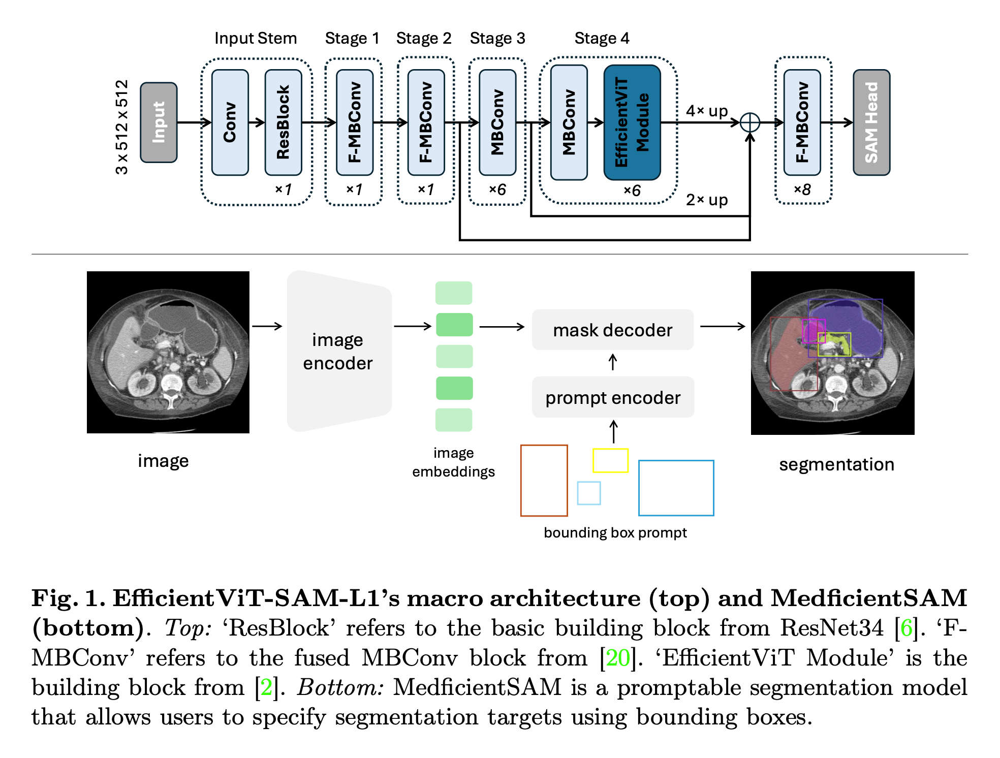
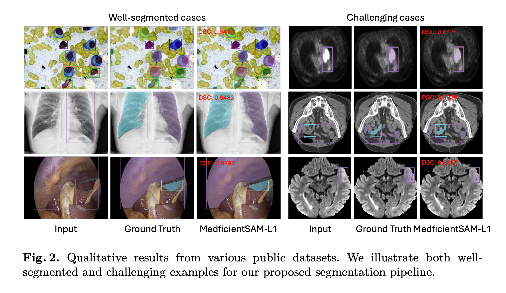

# <p align="center">MedficientSAM: A Robust Medical Segmentation Model with Optimized Inference Pipeline for Limited Clinical Settings</p>

<p align="center">


</p>

## Getting Started

```bash
git clone --recursive https://github.com/hieplpvip/medficientsam.git
cd medficientsam
conda env create -f environment.yaml -n medficientsam
conda activate medficientsam
```

### Environment and Requirements

| System                  | Ubuntu 22.04.5 LTS              |
| ----------------------- | ------------------------------- |
| CPU                     | AMD EPYC 7742 64-Core Processor |
| RAM                     | 256GB                           |
| GPU (number and type)   | One NVIDIA A100 40G             |
| CUDA version            | 12.0                            |
| Programming language    | Python 3.10                     |
| Deep learning framework | torch 2.2.2, torchvision 0.17.2 |

## Results on Validation Set

| Model            | Resolution | Params | FLOPs  |    DSC     |    NSD     | 2D Run Time | 3D Run Time | 2D Memory Usage | 2D Memory Usage |
| ---------------- | :--------: | :----: | :----: | :--------: | :--------: | :---------: | :---------: | :-------------: | :-------------: |
| MedficientSAM-L0 |  512x512   | 34.79M | 36.80G |   85.85%   |   87.05%   |  **0.9s**   |  **7.4s**   |    **448MB**    |    **687MB**    |
| MedficientSAM-L1 |  512x512   | 47.65M | 51.05G | **86.42%** | **87.95%** |    1.0s     |    9.0s     |      553MB      |      793MB      |
| MedficientSAM-L2 |  512x512   | 61.33M | 70.71G |   86.08%   |   87.53%   |    1.1s     |    11.1s    |      663MB      |      903MB      |

## Reproducibility

The Docker images can be found [here](https://drive.google.com/drive/folders/18lXbOa-zbn3GhagknlzxOXmtKGXY6nIk?usp=sharing).

```
docker load -i seno.tar.gz
docker container run -m 8G --name seno --rm -v $PWD/test_input/:/workspace/inputs/ -v $PWD/test_output/:/workspace/outputs/ seno:latest /bin/bash -c "sh predict.sh"
```

To measure the running time (including Docker starting time), see https://github.com/bowang-lab/MedSAM/blob/LiteMedSAM/CVPR24_time_eval.py

## Data Preparation

You need to participate in the [challenge](https://www.codabench.org/competitions/1847/) to access the dataset.
After downloading it, copy `.env.example` to `.env` and modify `CVPR2024_MEDSAM_DATA_DIR` to correct path.

The directory structure should look like this:

```
CVPR24-MedSAMLaptopData
├── train_npz
│   ├── CT
│   ├── Dermoscopy
│   ├── Endoscopy
│   ├── Fundus
│   ├── Mammography
│   ├── Microscopy
│   ├── MR
│   ├── OCT
│   ├── PET
│   ├── US
│   └── XRay
├── validation-box
    └── imgs
```

## Training

See [train_scripts](./train_scripts/).

## Inference

You can download the weights [here](https://drive.google.com/drive/folders/19RHM-qN4KUlCnHj_SJiUBwSbZybeCZfC?usp=sharing).

To run MedficientSAM-L1 on the validation set:

```
python src/infer.py experiment=infer_finetuned_l1
```

See [configs/experiment/infer\_\*](./configs/experiment) for running other model variants.

## Build Docker image

### Export model

```
python src/export_onnx.py experiment=export_finetuned_l0_cpp output_dir=weights/finetuned-l1-augmented/e2_cpp
```

### Build

```
docker build -f Dockerfile.cpp -t seno.fat .
slim build --target seno.fat --tag seno --http-probe=false --include-workdir --mount $PWD/test_input/:/workspace/inputs/ --mount $PWD/test_output/:/workspace/outputs/ --exec "sh predict.sh"
docker save seno | gzip -c > seno.tar.gz
```

## References

- https://github.com/ashleve/lightning-hydra-template
- https://github.com/mit-han-lab/efficientvit

<!-- ## Citation

If MedficientSAM is useful or relevant to your research, please kindly recognize our contributions by citing our paper:

```
TBU
``` -->
